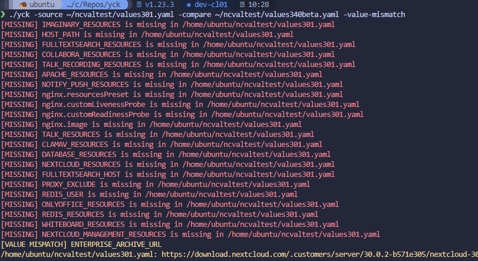

<div align="center">

  

# YCK - (Y)aml (C)ompare (K)eys
Let's you compare the keys of two YAML files and which one are missing or have different values.  

</div>

## Install
Get the releases depending on your plattform and add them to your PATH.  

e.g.
```
curl -LO https://github.com/xamma/yck/releases/download/vx.x.x/yck-linux-amd64
chmod +x yck-linux-amd64
sudo mv yck-linux-amd64 /usr/local/bin/yck
yck
```

## Usage

```
yck -h
yck -source ourvals.yaml --compare values340beta.yaml -value-mismatch
```

## Demo

  